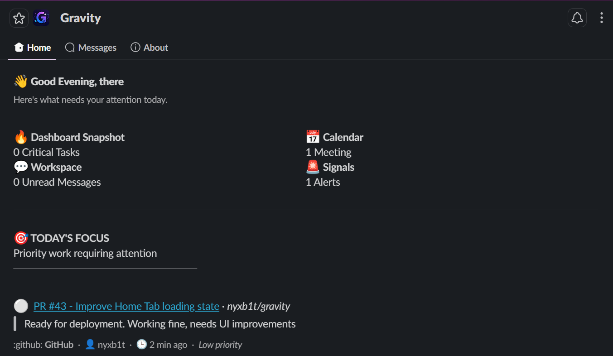
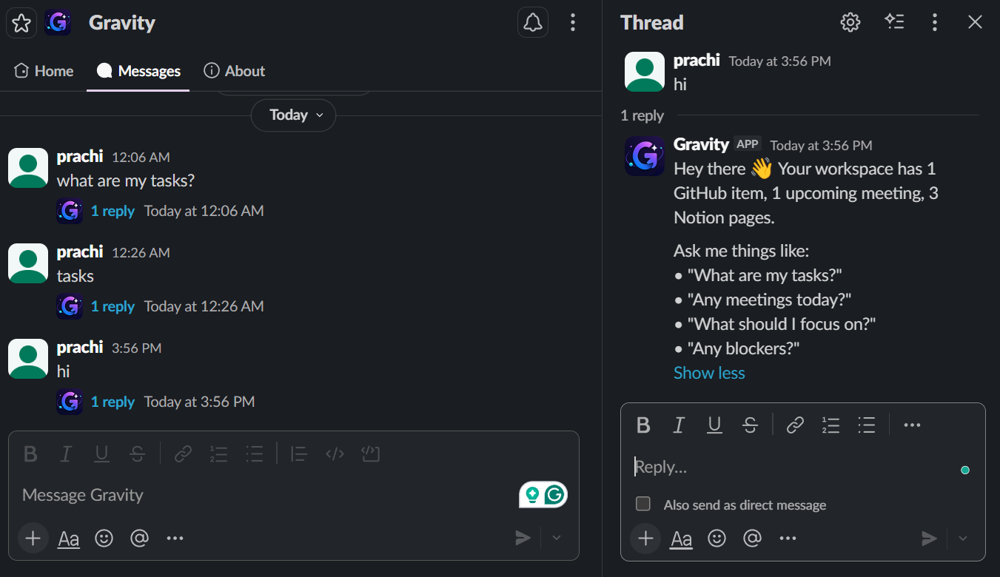
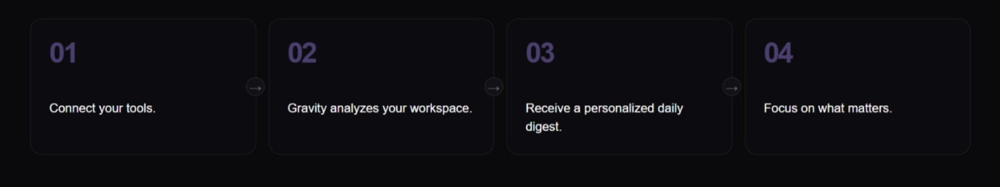
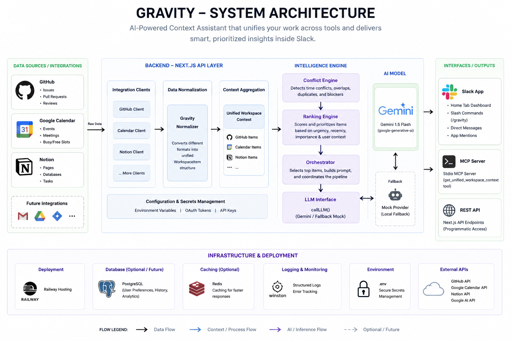

# 🌌 Gravity


> **Your proactive AI workplace intelligence agent for Slack.**

Gravity is an AI-powered workplace intelligence agent that unifies information across GitHub, Notion, and Google Calendar to proactively surface priorities, blockers, deadlines, and important updates directly inside Slack.

Instead of constantly switching between tools, teams can simply ask:

```text
What should I focus on today?
Are there any blockers?
What meetings are coming up?
Which tasks are at risk?
```

Gravity transforms scattered information into actionable insights and helps teams spend less time searching and more time building.

---

# 🚀 The Problem

Modern teams suffer from:

- Constant context switching
- Information overload
- Buried updates and missed deadlines
- Fragmented workflows across multiple platforms
- Decision fatigue from excessive notifications

People spend more time **finding information** than actually acting on it.

---

# 💡 Our Solution

Gravity creates a unified intelligence layer on top of your workspace.

By integrating with:

- GitHub
- Notion
- Google Calendar
- Slack

Gravity continuously analyzes your workspace and behaves like an intelligent teammate that helps everyone stay aligned and focused.

---

# ✨ Features

## 🧠 Unified Workspace Intelligence

Aggregates information from multiple platforms into a single contextual workspace.

---

## 💬 Conversational AI Assistant

Interact naturally with Gravity:

```text
Hi
What should I focus on today?
Any blockers?
Any meetings tomorrow?
```

Gravity responds contextually instead of presenting static dashboards.

---

## 🏠 Proactive Home Dashboard

Gravity automatically surfaces:

- Priority tasks
- Upcoming meetings
- Pending approvals
- Workspace risks
- Suggested next actions

---

## 🔥 Intelligent Prioritization

Automatically identifies:

- Urgent pull requests
- Overdue tasks
- Meeting conflicts
- Sprint risks
- Workspace bottlenecks

---

## 🔗 Multi-Source Context Understanding

Gravity understands relationships across:

- GitHub Issues & Pull Requests
- Notion Documents & Pages
- Calendar Events
- Slack Conversations

---

## ⚡ Graceful AI Fallback

If Gemini API quotas are exceeded, Gravity automatically falls back to deterministic prioritization logic to ensure uninterrupted functionality.

---

# 📸 Screenshots

## 🏠 Home Dashboard



---

## 💬 Conversational Assistant



---

## 📊 Workspace Priorities



---

# 🏗 System Architecture



```text
GitHub
     \
Notion -----> Workspace Context Layer
     /
Calendar

            ↓

      Intelligence Engine

            ↓

     Prioritization Layer

            ↓

      Slack Home + Messages
```

---

# 🛠 Tech Stack

## Frontend

- Next.js
- React
- TypeScript
- Tailwind CSS

## Backend

- Node.js
- Next.js API Routes
- Slack Bolt SDK

## Integrations

- GitHub API
- Google Calendar API
- Notion API

## AI

- Google Gemini API

## Deployment

- Railway

---

# 🎯 Example Use Cases

### Engineering Teams

Instantly identify blockers and pending reviews.

### Product Managers

Track deadlines and project health.

### Startup Teams

Reduce context switching and improve alignment.

### Remote Teams

Maintain shared awareness without unnecessary meetings.

---

# 📂 Project Structure

```bash
app/
├── api/
│   ├── gravity/
│   └── slack/

integrations/
├── github/
├── notion/
├── calendar/

slack/
├── commands/
├── events/
├── home/

utils/
types/
```

---

# ⚙️ Environment Variables

Create a `.env.local` file:

```env
# AI
GEMINI_API_KEY=

# Slack
SLACK_BOT_TOKEN=
SLACK_SIGNING_SECRET=
SLACK_APP_TOKEN=

# GitHub
GITHUB_TOKEN=
GITHUB_OWNER=
GITHUB_REPO=

# Google Calendar
GOOGLE_CLIENT_ID=
GOOGLE_CLIENT_SECRET=
GOOGLE_REFRESH_TOKEN=

# Notion
NOTION_TOKEN=
NOTION_DATABASE_ID=

# Features
USE_LIVE_DATA=true
```

---

# 🚀 Getting Started

Install dependencies:

```bash
npm install
```

Run development server:

```bash
npm run dev
```

Run Slack Socket Mode:

```bash
npm run slack:dev
```

---

# 🧪 Example Prompts

```text
Hi
What should I focus on today?
Any blockers?
What meetings do I have today?
What changed recently?
Show sprint risks.
```

---

# 🎥 Demo

Gravity demonstrates:

✅ Real GitHub Integration  
✅ Real Google Calendar Integration  
✅ Real Notion Integration  
✅ Conversational AI Assistance  
✅ Proactive Workspace Intelligence  
✅ Graceful AI Fallbacks

🎬 Demo Video: [https://youtu.be/ClpMUwlQ_B4?si=pehhqqcCbuoj4IvO]

🌐 Railway Deployment: [gravity-production-b956.up.railway.app]

---

# 🌟 Why Gravity?

Modern teams are drowning in fragmented information spread across multiple tools.

Current tools provide information.

**Gravity provides understanding.**

Gravity acts as an intelligent teammate that:

- Reduces context switching
- Surfaces what matters most
- Identifies blockers proactively
- Keeps teams aligned
- Helps users focus on meaningful work

Instead of another dashboard, Gravity becomes a workplace copilot.

---

# 🔮 Future Scope

- Jira Integration
- Linear Integration
- Email Intelligence
- Meeting Summaries
- Workspace Memory
- Predictive Risk Detection
- Autonomous AI Agent Capabilities

---

# 👥 Team

Built with ❤️ during a hackathon by:

- **Prachi** — AI & Backend
- **Garima** — Frontend & User Experience
- **Sarthak** — MCP Integrations & Infrastructure

---

# 🌌 Gravity

> **Transforming workplace chaos into actionable clarity.**

Built for teams drowning in notifications, context switching, and fragmented information.

Gravity helps teams focus on what truly matters.
